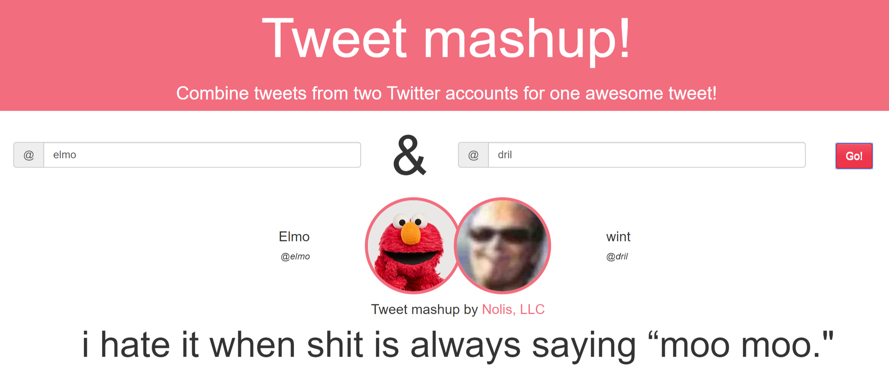

# Tweet Mashup (Shiny version)



This is the feature-limited port of the original [Tweet Mashup](https://github.com/jnolis/TweetMashup) from F# to R. It uses [Shiny](https://shiny.rstudio.com/) and [rtweet](https://github.com/ropensci/rtweet) to recreate the original interface. The Shiny application is hosted in a Shiny Server using a Docker image from a modified [T-Mobile Tensorflow R container](https://github.com/tmobile/r-tensorflow-api)

## Setup

Before you can use this app you first need to setup a Twitter application for it:

__1. Register the application__ - Go to [https://developer.twitter.com/en/apps](https://developer.twitter.com/en/apps) and create an application. This make take some time to get approval

__2. Get the keys__ - If you click the details of the app you created you'll see four keys: consumer key, consume secret key, access token, and access token secret. Take these keys and save them to a json file with the following format:

```json
{
  "twitter": {
    "consumer_key": "[CONSUMER KEY]",
    "consumer_secret": "[CONSUMER SECRET]",
    "access_token": "[ACCESS TOKEN]",
    "access_secret": "[ACCESS TOKEN SECRET]"
  }
}
```

This file should be saved to `/src/app/config.json`.

__3. Set the callback url__ - Finally, in the Twitter developer site you'll need to add the appropriate callback urls. This is required and needs to be anywhere you will host the application. This means you'll want to include:

* `http://127.0.0.1` - for testing the application locally
* `[url you host it on]` - for when it's running live
* `http://127.0.0.1:1410` [optional] - if you want to do general experimentation with rtweet this will allow you to easily authenticate

__4. Add google analytics (optional)__ - If you want to add Google analytics, create a GA account and get the ID for your page, then add it to the config.json file as so:

```json
{
  "twitter": {
    "consumer_key": "[CONSUMER KEY]",
    "consumer_secret": "[CONSUMER SECRET]",
    "access_token": "[ACCESS TOKEN]",
    "access_secret": "[ACCESS TOKEN SECRET]"
  }
  "google-analytics-id": "UA-00000000-0"
}

__5. Create a password to encrypt the credentials__ - [WRITE LATER BECAUSE I DON'T FEEL LIKE IT]
```

## Running directly

After following the setup instructions, you can go into the `src` folder and run the following r command:

```r
shiny::runApp("app",port=80L, launch.browser = FALSE)
```

After running this command you can navigate to `http://127.0.0.1` in your broswer and test it out.

## Building the Docker image

Instead of directly running the R code, you can create a Docker image with the R code inside it.

Before starting ensure you have [installed Docker](https://docs.docker.com/v17.09/engine/installation/)
To build the container with docker installed use the following command from the commany line in the base folder of the repository:

```
docker build -t tweet-mashup-r .
```

To run it locally, do the following:

```
docker run -it --rm -p 80:80 tweet-mashup-r
```

Then navigate to `http://127.0.0.1` to try it out! 

## Deploying to a Google Cloud Compute Engine Virtual Machine

One of the easiest ways to publically host this app is with Google Cloud Compute Engine Virtual Machines. I have been able to host it for around $20 a month, but it's likely possible to do it fore more cheaply. To do so, first create a [Google Cloud project](https://cloud.google.com/resource-manager/docs/creating-managing-projects). Then run the following commands:

First, tag the container with how you want to add it to Google Cloud Registry (this will be how it's available to the virtual machine):

```
docker tag tweet-mashup-r gcr.io/[PROJECT NAME]/tweet-mashup-r:latest
```

Then, push it to Google Cloud Registry. This actually makes it to GCP:

```
docker push gcr.io/[PROJECT NAME]/tweet-mashup-r:latest
```

Finally, create an instance that runs it. We'll use an instance that size "g1-small" which is the smallest container that is sufficiently powerful for the task. We also will specify that the server should be open to http traffic. The zone defaults to with the united states (us-central1-a), but this could be adjusted to your region.

```
gcloud compute instances create-with-container tweet-mashup-r-vm --zone us-central1-a --machine-type g1-small --tags http-server --container-image=gcr.io/[PROJECT NAME]/tweet-mashup-r:latest
```

After the container is deployed, if you make changes to the container you can redeploy them by building, tagging, and pushing the new container and restarted the VM. You can do this by running the following:

```
docker build -t tweet-mashup-r .

docker tag tweet-mashup-r gcr.io/[PROJECT NAME]/tweet-mashup-r:latest

docker push gcr.io/[PROJECT NAME]/tweet-mashup-r:latest

gcloud compute instances reset tweet-mashup-r-vm
```